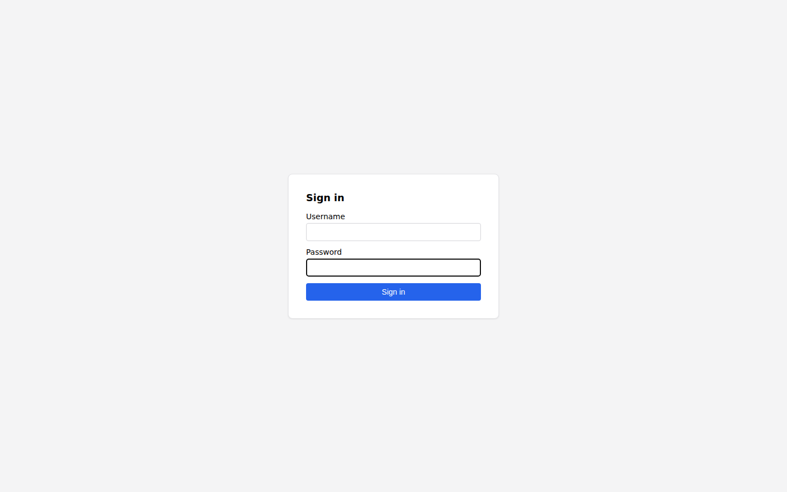
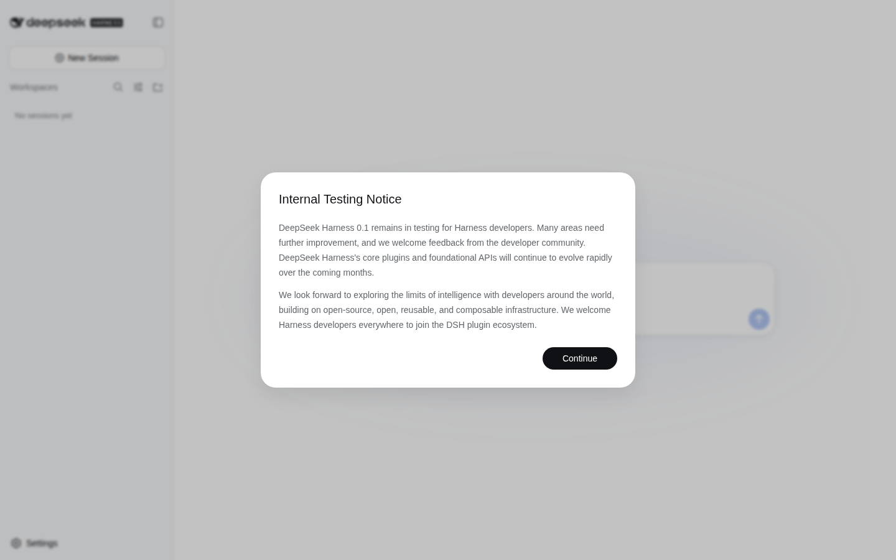

# dsh-auth-gate

**English** | [简体中文](README.zh.md)

A login door for your [DeepSeek Harness](https://github.com/deepseek-ai/dsh)
(dsh) web instance. Put it in front of a public dsh deployment and nobody can
reach your agents, your chat sessions, or your LLM credentials without signing
in first.

## What it does

- **Everything needs a login.** Every page, API call, and WebSocket connection
  is checked. Visitors without a valid session are sent to a simple login page
  (or rejected with `401` for API/script requests).
- **Two ways to sign in** (pick one in the configuration):
  - **Password** (recommended): each admin gets a username and password.
  - **Token**: one shared secret token for the whole instance.
- **Works for browsers and scripts.** Browsers use the login page; scripts and
  curl can pass `Authorization: Bearer <token>` and skip the page entirely.
- **Safe by default.** Passwords are stored hashed, logins are rate-limited
  (repeated wrong attempts temporarily lock the address), session cookies are
  secure, and any missing or broken configuration **blocks access instead of
  silently opening the door**.
- **A small command-line tool** for managing users:

  ```sh
  dsh-auth user add admin --password-stdin   # add a user
  dsh-auth user list                          # list users
  dsh-auth user disable admin                 # block a user's future logins
  ```

## Quick start

```sh
# 1. Install the plugin from npm into your dsh profile
dsh plugin --profile web add dsh-auth-gate

# 2. Create an admin account
printf '%s\n' 'choose-a-strong-password' | dsh-auth user add admin --password-stdin

# 3. Turn on password login: add the dsh-auth row to $DSH_HOME/cordis.patch.yml
#    (a ready-to-use template ships in deploy/cordis.patch.yml; see Configuration)

# 4. Restart dsh. Open your site — you will be asked to sign in.
```

## See it in action

Visitors without a session are sent to the login page:



After signing in, they land on your instance:



## Configuration

Edit `$DSH_HOME/cordis.patch.yml` (copy the shipped template from
`deploy/cordis.patch.yml`). The `dsh-auth` row:

```yaml
- insert:
    - id: dsh-auth
      name: dsh-auth-gate
      config:
        mode: "password" # "password" (recommended) or "token"
        cookieSecure: true # keep true when you use https
```

| Option         | Default            | What it does                                                                       |
| -------------- | ------------------ | ---------------------------------------------------------------------------------- |
| `mode`         | `"token"`          | `"password"` = username/password login; `"token"` = one shared secret              |
| `sessionTtl`   | `604800`           | How long a login lasts (seconds) before you must sign in again                     |
| `cookieName`   | `dsh_auth`         | Name of the session cookie (rarely needs changing)                                 |
| `tokenRef`     | `"DSH_AUTH_TOKEN"` | Token mode only: which environment variable holds the shared secret                |
| `cookieSecure` | `true`             | Set to `false` only if you are testing over plain http                             |
| `usersFile`    | `""`               | Password mode: where your user list lives. Defaults to `$DSH_HOME/auth/users.yaml` |

## Requirements

- Node ≥ 22.19 and pnpm on the server.
- The dsh `web` profile running (`dsh --profile web`).
- If `cookieSecure` is `true`, your site must be served over https (browsers
  refuse secure cookies on plain http).

## Notes & limitations

- Disabling a user only stops **new** logins; already-signed-in sessions stay
  valid until they expire.
- Login rate limiting resets when the server restarts.
- Behind a reverse proxy, rate limiting counts by the proxy's address.
- There is no logout button in the dsh interface yet — visit
  `/auth/logout?next=/` to sign out.
- The plugin only protects dsh's web surface. It is not a replacement for
  server-level security: keep the server OS user locked down and the config
  files private (`.credentials.yaml` and `auth/users.yaml` are created with
  `0600` permissions).
